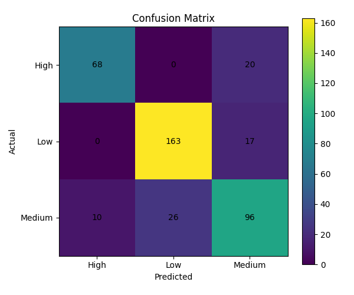

# Model Methodology: How Stress Level Is Calculated

This document explains the machine learning approach behind the Personnel Stress and Welfare Monitoring System's risk classifier — what the model is, how it processes personnel data, and how to interpret its output.

---

## 1. Overview

The system uses a **Random Forest Classifier** to predict a personnel member's stress risk category — **Low**, **Medium**, or **High** — from behavioral, organizational, and duty-related indicators (deployment history, duty hours, leave patterns, sleep, and support metrics).

Random Forest was chosen over a single decision tree or a linear model for three reasons relevant to this use case:

- It handles a mix of numeric (e.g., `Sleep_Hours`, `Deployment_Days`) and ordinal categorical (e.g., `Work_Pressure_Level`) features without requiring heavy feature scaling.
- It is an **ensemble** method, meaning it averages the judgment of many independently trained decision trees rather than relying on one — this reduces the risk of the model overfitting to noise in a single feature, which matters given the dataset's synthetic origin (see [`FEATURE_RATIONALE.md`](./FEATURE_RATIONALE.md)).
- It naturally outputs **class probabilities**, not just a hard label — essential for a welfare tool, where showing a risk *gradient* is more responsible and less stigmatizing than a flat yes/no.

---

## 2. Data Pipeline

### Step 1 — Load and separate features from the target
The target variable is `Stress_Level` (Low / Medium / High). The `ID` column is dropped since it carries no predictive information, and all remaining columns become the feature set `x`.

### Step 2 — Encode categorical fields
Five ordinal fields are label-encoded so the model can process them numerically:

```
Work_Pressure_Level, Work_Life_Balance, Family_Support_Level,
Job_Satisfaction, Training_Opportunities
```

Each encoder is saved alongside the model (`encoders` dictionary in `model.pkl`) so the exact same encoding can be reapplied consistently to new personnel data at inference time — this avoids a common bug where categories get encoded differently between training and deployment.

### Step 3 — Train-test split
The data is split 80/20 using `stratify=y`, which preserves the proportion of Low, Medium, and High cases in both the training and test sets. This matters because High-risk cases are the minority class — without stratification, a random split could under-represent them in the test set and give a misleading picture of how well the model actually catches at-risk personnel.

---

## 3. Model Configuration

```python
RandomForestClassifier(
    n_estimators=200,
    random_state=42,
    class_weight="balanced"
)
```

- **`n_estimators=200`** — the forest is built from 200 individual decision trees, each trained on a randomly resampled subset of the training data (bootstrap aggregation, or "bagging"). Averaging across 200 independently trained trees smooths out the idiosyncrasies any single tree might learn from a particular slice of data.
- **`class_weight="balanced"`** — this is the most important setting for this project's goals. It automatically re-weights the training process so that mistakes on the minority class (High) are penalized more heavily than mistakes on the majority class (Low). Without this, a classifier can achieve deceptively high accuracy just by defaulting to the majority class — which is exactly the failure mode this project cannot afford, since a missed High-risk case is the most costly type of error in a welfare context.
- **`random_state=42`** — fixes the randomness so results are reproducible across runs.

---

## 4. How a Prediction Is Actually Made

1. A personnel member's feature values (duty hours, sleep, leave gap, etc.) are passed into all 200 trees simultaneously.
2. Each tree independently outputs one class label based on the decision rules it learned during training.
3. The forest's final **probability** for each class is simply the fraction of the 200 trees that voted for it. For example: `High: 0.55, Medium: 0.33, Low: 0.12`.
4. The predicted label is the class with the highest vote share — in the example above, **High**.

This is why Random Forest output is naturally suited to a dashboard: instead of a flat label, a welfare officer can see *how confident* the model is (e.g., "55% High" reads very differently from "91% High"), supporting graded intervention rather than a binary red flag.

---

## 5. Evaluation Results

Evaluated on the held-out 20% test set (400 personnel records):

| Metric | Score |
|---|---|
| Overall Accuracy | **81.8%** |
| Weighted Precision | ~0.82 |
| Weighted Recall | ~0.82 |
| Weighted F1-Score | ~0.82 |

### Per-Class Breakdown (from the Confusion Matrix)

| Class | Precision | Recall | F1-Score |
|---|---|---|---|
| **High** | 87.2% | 77.3% | 0.82 |
| **Medium** | 72.2% | 72.7% | 0.73 |
| **Low** | 86.2% | 90.6% | 0.88 |



**Reading the confusion matrix:** rows represent the actual stress level, columns represent what the model predicted. The diagonal (68, 163, 96) shows correct predictions; everything off-diagonal is a misclassification.

The number we care about most is **High-class recall (77.3%)** — of all personnel who were genuinely High risk, the model correctly flagged 68 out of 88. The 20 missed cases (predicted as Medium instead of High) represent the model's current false-negative rate on the highest-stakes class, and are the primary target for future improvement — most directly through the threshold-tuning approach described below.

Reassuringly, **zero High-risk cases were misclassified as Low** — when the model errs on a High-risk individual, it still places them in the adjacent Medium category rather than dismissing them entirely, which is a meaningfully safer failure pattern for a welfare-monitoring context.

---

## 6. Why Recall Matters More Than Accuracy Here

In a wellness-monitoring context, the two types of errors are not equally costly:

- **False Negative** (a High-risk person predicted as Medium/Low): a genuinely stressed individual goes unflagged and receives no intervention. This is the outcome the system exists to prevent.
- **False Positive** (a Low/Medium-risk person predicted as High): a welfare officer does an unnecessary check-in. Mildly inconvenient, not harmful.

Because of this asymmetry, the project prioritizes **recall on the High class** over raw accuracy, and `class_weight="balanced"` is the first lever used to push the model in that direction. This is also why we don't simply report accuracy in isolation — accuracy can look strong while quietly hiding poor performance on the exact class this system was built to catch.

---

## 7. Planned Refinement: Threshold Tuning

By default, the model assigns the class with the single highest probability. An additional refinement — lowering the probability bar required to flag someone as "High" (e.g., flag as High if `P(High) ≥ 0.3`, rather than requiring it to be the outright maximum) — can push recall on the High class even higher, at the cost of some additional false positives. Given the cost asymmetry above, this is a deliberate, justifiable trade-off for a production version of this system.

---

## 8. Model Artifacts

The trained model is serialized with `joblib` into `model.pkl`, which bundles three components together:

```python
{
    "model": model,          # the trained RandomForestClassifier
    "encoders": encoders,    # LabelEncoders for each categorical field
    "features": x.columns.tolist()  # exact feature order expected at inference
}
```

Bundling these together ensures that any backend service loading the model can reconstruct predictions correctly without needing to separately track encoding logic or feature ordering.

---

## 9. Limitations

- The dataset used to train this model is **synthetically generated** due to the unavailability of real CAPF personnel data. See [`FEATURE_RATIONALE.md`](./FEATURE_RATIONALE.md) for the research basis behind each feature and an honest breakdown of which fields are directly evidenced versus included on general wellness grounds.
- Reported metrics reflect performance on synthetic data and should be treated as a demonstration of the pipeline and modeling approach, not as validated real-world predictive accuracy.
- Future work includes threshold tuning for recall optimization, SHAP-based per-prediction explainability for welfare officers, and retraining once representative (anonymized, consented) real-world data becomes available.
